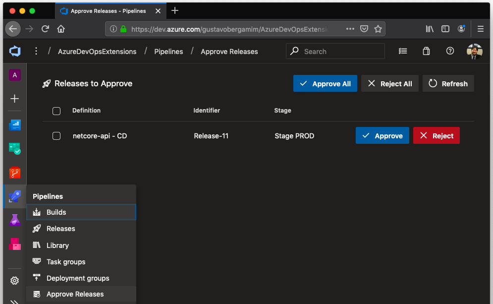

# Azure Pipelines Approval

This extension allows you to easily view releases that are pending approval for your user, allowing you to approve them directly from a simple grid view. You can approve them one by one or in batch.

## Getting started

1. From the Pipeline hub, select the **Approve Release** option
2. The grid will display all releases pending approval
3. From each release, you can **approve** or **reject**
   **Note:** If you prefer, you can select more than one release for approval (or rejection) and select **Approve All** (**Reject All**) button.
4. If you want/need, You can schedule deployment for later with deferred deployment feature

## Feature Backlog

This release has minimal functionality to perform approvals, but we are working on more features and enhancements to refine and complete the extension.

Here are some features we're working on. Feel free to suggest any other feature.

* **Grid filters:** allows to filter pending approvals by definition, identifier, status or stage/environment.
* **Sortable columns:** allows to sort items.
* **Comments:** allows you to enter a comment for approval or rejection.
* **UI improvements**: show more version approval information, such as which group the user is a member of and needs to approve on their behalf. Change some colors and add theme support for deferred deployment date picker.

## Pipeline

| Branch  | Pipeline                                                                                                                                                                                                                                                                                        |
| ------- | ----------------------------------------------------------------------------------------------------------------------------------------------------------------------------------------------------------------------------------------------------------------------------------------------- |
| master  |   |
| develop |  |

## Contributors

Special thanks to Vinicius Moura (Microsoft MVP) for always helping with Azure DevOps related questions and ideas.

## Contribute

This extension is free, but if you enjoyed the work and would like to help the developer stay up:

